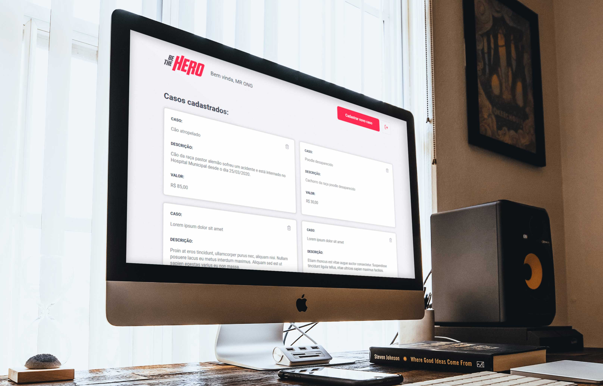
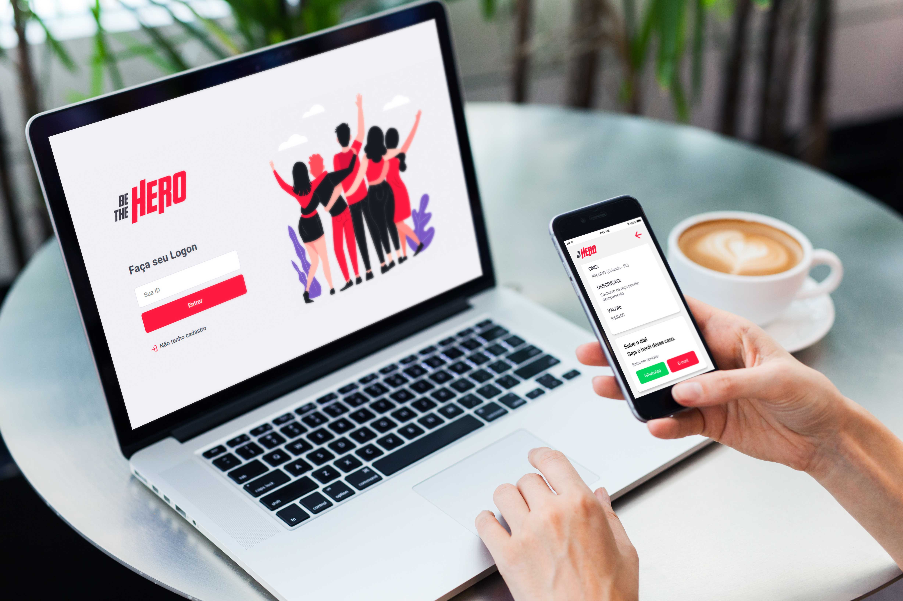
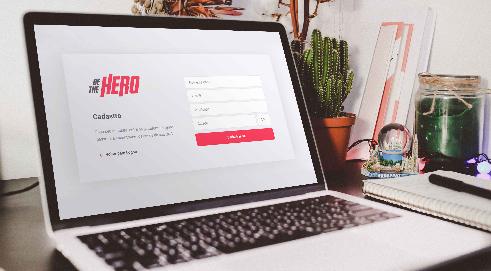
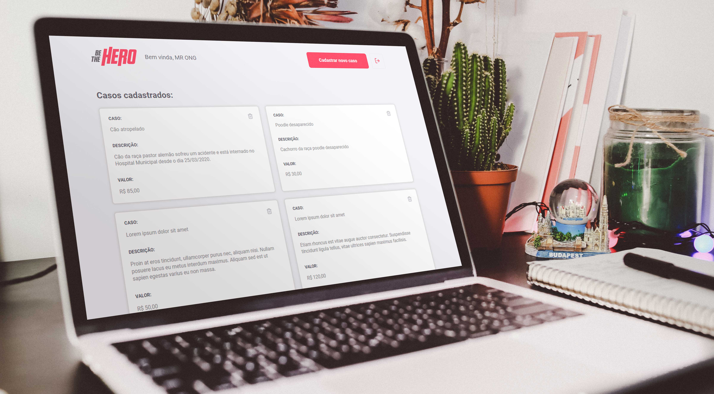
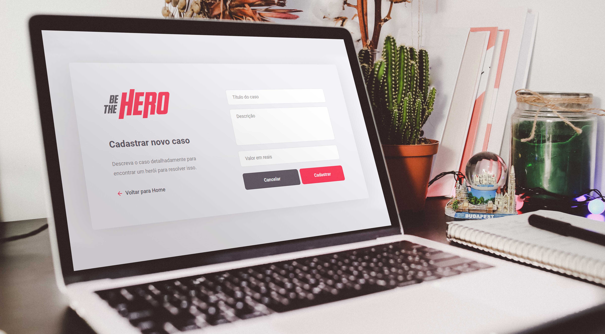
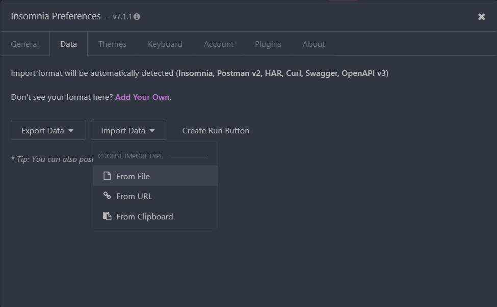
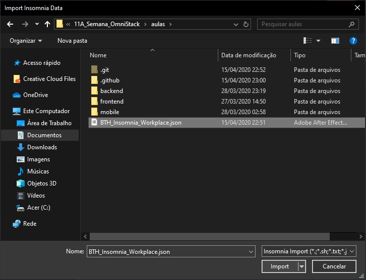

<link rel="stylesheet" href="https://cdnjs.cloudflare.com/ajax/libs/font-awesome/4.7.0/css/font-awesome.min.css">

<h1 align="center">
    
</h1>

<h2 align="center">
  Be the Hero - Semana OmniStack 11
</h2>

<div align="center">
  
</div>

<h3 align="center">
  <a href="https://github.com/mathrb22">
    
  </a>
  
  <a href="https://github.com/nodejs/node/blob/master/doc/changelogs/CHANGELOG_V12.md#12.16.1">
    
  </a>
  <a aria-label="React Version" href="https://github.com/facebook/react/blob/master/CHANGELOG.md#16131-march-19-2020">
    </img>
  </a>
  
  <a href="https://github.com/mathrb22/SemanaOmnistack11/commits/master">
    
  </a>
  
  <a href="https://github.com/mathrb22/SemanaOmnistack11/blob/master/LICENSE">
    
  </a>
</h3>

 [**Sobre**](#📃-sobre) &nbsp;&nbsp;**|**&nbsp;&nbsp;
 [**Tecnologias utilizadas**](#🚀-tecnologias-utilizadas) &nbsp;&nbsp;**|**&nbsp;&nbsp;
 [**Layout**](#📟-layout) &nbsp;&nbsp;**|**&nbsp;&nbsp;
 [**Instalação e execução**](#🔧-instalação-e-execução) &nbsp;&nbsp;**|**&nbsp;&nbsp;
 [**Como contribuir**](#💡-como-contribuir) &nbsp;&nbsp;**|**&nbsp;&nbsp;
 [**Contato**](#📲-contato) &nbsp;&nbsp;**|**&nbsp;&nbsp;
 [**Licença**](#📝-licença)

---

## 📃 Sobre

**Be The Hero** é um projeto desenvolvido durante a **11ª Semana OmniStack**, um evento online com duração de uma semana, onde cada dia foi desenvolvida uma etapa da aplicação, desde o back-end (banco de dados, rotas), até o front-end (interface do usuário) e mobile (aplicativo para celular).

O **objetivo** do projeto é de conectar pessoas que desejam fazer contribuições monetárias a **ONGs** (Organizações não governamentais) que precisam de ajuda.

Este sistema possui a **interface web**, com a parte administrativa exclusiva para as ONGs. Estas tem a possibilidade de se cadastrar, fazer login, cadastrar e deletar casos.

<div align="center">
  
</div>
<br/>

Existe também o **aplicativo para dispositivos móveis** (Android e iOS), desenvolvido em **React Native**, contendo somente a seção dos heróis. Na página inicial é possível visualizar uma lista completa com todos os casos cadastrados pelas ONGs no banco de dados.

<div align="center">
  
</div>
<br/>

Além disso, os usuários que acessarem o aplicativo, podem ver mais **detalhes** de um caso específico, como o nome da ONG, cidade, estado e descrição. Caso desejem contribuir com alguma quantia, podem entrar em contato por **e-mail** ou **Whatsapp**, diretamente pelo app.

<div align="center">
  
</div>
<br/>

> Este projeto foi desenvolvido para fins de estudo e aprendizado próprio, com foco na linguagem JavaScript e as demais ferramentas e tecnologias da OmniStack. Portanto, será atualizado constantemente. 

## 🚀 Tecnologias utilizadas

Este projeto foi desenvolvido com as seguintes tecnologias:
- [**Visual Studio Code**](https://code.visualstudio.com/): um editor de código-fonte desenvolvido pela Microsoft para Windows, Linux e macOS, recomendado para o desenvolvimento de aplicações web;
- [**Node.js**](https://nodejs.org/en/): um interpretador de JavaScript assíncrono com código aberto orientado a eventos;
- [**React**](https://reactjs.org): uma biblioteca JavaScript de código aberto com foco em criar interfaces de usuário (frontend) em páginas web. É mantido pelo Facebook, Instagram, outras empresas e uma comunidade de desenvolvedores individuais. É utilizado nos sites da Netflix, Imgur, Feedly, Airbnb, SeatGeek, HelloSign, Walmart e outros;
- [**React Native**](https://facebook.github.io/react-native/): uma biblioteca Javascript criada pelo Facebook. É usada para desenvolver aplicativos para os sistemas Android e IOS de forma nativa;
- [**Expo**](https://expo.io/): uma ferramenta utilizada no desenvolvimento mobile com React Native que permite o fácil acesso às API's nativas do dispositivo sem precisar instalar qualquer dependência ou alterar código nativo;

Outros recursos utilizados:
- [**Insomnia**](https://insomnia.rest/): um poderoso cliente de API REST com gerenciamento de cookies, variáveis de ambiente, geração de código e autenticação para Mac, Window e Linux;
- [**Express**](https://expressjs.com/pt-br/): um popular framework web estruturado, escrito em JavaScript que roda sobre o ambiente node.js em tempo de execução;
- [**Knex**](http://knexjs.org/): um query builder em JavaScript para bancos de dados relacionais, como PostgreSQL, MySQL, SQLite3, e Oracle;
- [**SQLite3**](https://www.sqlite.org/version3.html): uma biblioteca open-source desenvolvida em linguagem C, que funciona como um gerenciador de bancos de dados relacionais dentro da própria aplicação, sem a necessidade de utilizar um sistema separado.

## 📟 Layout
O layout da aplicação **Be The Hero** foi desenvolvido pela equipe da [Rocketseat](https://github.com/Rocketseat/) através da ferramenta online [Figma](https://www.figma.com), um software de prototipação voltado para **UI Design (design de interface)**.
Você pode acessar o layout através deste link: [Be The Hero - OmniStack 11](https://www.figma.com/file/2C2yvw7jsCOGmaNUDftX9n/Be-The-Hero---OmniStack-11?node-id=0%3A1).

> **OBS:** O layout deste repositório contém diversas modificações feitas por mim mesmo durante o desenvolvimento da interface gráfica.

<figure>
<div align="center">
  
  <figcaption>Página de Login</figcaption>
</div>
</figure>
<br/>

<figure>
<div align="center">
  
  <figcaption>Página de cadastro de ONGs</figcaption>
</div>
</figure>
<br/>

<figure>
<div align="center">
  
  <figcaption>Página de perfil da ONG</figcaption>
</div>
</figure>
<br/>

<figure>
<div align="center">
  
  <figcaption>Página de cadastro de novos casos</figcaption>
</div>
</figure>
<br/>

## 🔧 Instalação e execução

Para você poder instalar e executar esta aplicação, terá que ter instalado em sua máquina o [Git](https://git-scm.com/) e o [Node.js](https://nodejs.org/en/).
Em seguida, no terminal execute os seguintes comandos segundo as instruções:  
### Backend

1. Clone este repositório:
    ```bash
    $ git clone https://github.com/mathrb22/SemanaOmnistack11
    ```
2. Vá até a pasta backend do repositório:
    ```bash
    $ cd backend
    ```
3. Instale as dependências do projeto:
    ```bash
    $ npm install
    ```
4. Execute as migrations (banco de dados):
    ```bash
    $ npx knex migrate:latest
    ```
5. Execute o servidor:
    ```bash
    $ npm start
    ```
6. Para importar a Workplace do **Insomnia** com todas as rotas e requests da aplicação, abra o aplicativo Insomnia. No menu principal, acesse as preferências, selecione **DATA**, e "Import Data", como mostram as imagens a seguir:

    <div align="center">
      
      <figcaption>Importando a Workplace do Insomnia</figcaption>
    </div>
    <br/>
    <div align="center">
      
      <figcaption>Selecione o arquivo <b>BTH_Insomnia_Workplace.json</b></figcaption>
    </div>

---
### Frontend (Web)

1. Vá até a pasta frontend do repositório:
    ```bash
    $ cd frontend
    ```
2. Instale as dependências:
    ```bash
    $ npm install
    ```
3. Execute a aplicação web:
    ```bash
    $ npm start
    ```

- Acesse a aplicação pela rota _**localhost:3000**_.
---
### Mobile

1. Vá até a pasta mobile do repositório:
    ```bash
    $ cd mobile
    ```
2. Instale as dependências:
    ```bash
    $ npm install
    ```
    >Verifique se o Expo foi instalado normalmente, executando ``expo -h``. Caso retorne algum erro:
    * Instale o Expo na pasta raiz de forma GLOBAL
       ```bash
       $ npm install -g expo-cli
       ```
3. Execute a aplicação mobile:
    ```bash
    $ npm start
    ```
- Para executar a aplicação mobile, você pode instalar o aplicativo **Expo** disponível na [**Google Play**](https://play.google.com/store/apps/details?id=host.exp.exponent) e [**App Store**](https://apps.apple.com/br/app/expo-client/id982107779). Este aplicativo permite que você visualize a API em seu próprio celular. 
- Antes de executar: vá até o arquivo **``api.js``** acessando as pastas ``mobile / src / services / api.js``, adicione seu endereço IP e salve o arquivo;
- Agora, verifique se o seu computador está conectado à mesma rede que o dispositivo móvel.
- Ao executar a API com **``npm start``**, aguarde o carregamento dos scripts. Será aberto uma interface do **Expo** em seu navegador com o título: _**"Be The Hero on Expo Developer Tools"**_. Aqui é possível visualizar o status de Metro Builder, configurações de conexão e outras opções como:
  
  >* Run on Android device/emulator
  >* Run on iOS simulator
  >* Run in web browser
  >* Send link with email…
  >* Publish or republish project…

- Após o **Expo** estar instalado em seu celular, abra-o, escaneie o QR Code e a API será executada.
- Caso queira executar a API pelo computador, instale algum **emulador Android/iOS**.

## 💡 Como contribuir

- Faça um **_fork_** desse repositório;
- Crie um **branch** para a sua feature: `git checkout -b minha-feature`;
- Faça um **commit** com suas alterações: `git commit -m 'feat: Minha nova feature'`;
- Faça um **push** para a sua branch: `git push origin minha-feature`;
- Faça um **pull request** com sua feature, e em seguida realize um **merge**;

> Após o merge de seu **pull request** ser feito, você pode deletar a sua branch.

Pull requests são sempre bem-vindos. Em caso de dúvidas ou sugestões, crie uma _**issue**_ ou entre em contato comigo.


## 📲 Contato

Entre em contato comigo por e-mail ou pelo meu LinkedIn:

**Gmail:** [mathribe2020@gmail.com](mailto:mathribe2020@gmail.com)

**LinkedIn:** [Matheus Ribeiro](https://www.linkedin.com/in/matheus-ribeiro-33496a11b/)

## 📝 Licença


Esse projeto está sob a licença **MIT**. Veja o arquivo _**LICENSE**_ para mais detalhes.
***

<h5 align="center">
  &copy;2020 - <a href="https://github.com/mathrb22/">Matheus Ribeiro</a>
</h5>
