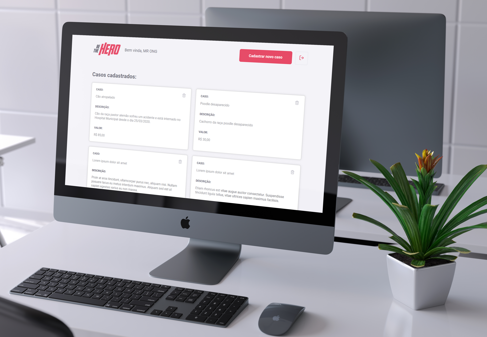

<h1 align="center">
    
</h1>

<h2 align="center">
  Be the Hero - Semana OmniStack 11
</h2>

<div align="center">
  
</div>

<h3 align="center">
  <a href="https://github.com/mathrb22">
    
  </a>
  
  
  
  
  
</h3>

<h5 align="center">
  <a href="#📃-sobre">Sobre</a>&nbsp;&nbsp;&nbsp;|&nbsp;&nbsp;&nbsp;
  <a href="#🚀-tecnologias-utilizadas">Tecnologias utilizadas</a>&nbsp;&nbsp;&nbsp;|&nbsp;&nbsp;&nbsp;
  <a href="#📟-layout">Layout</a>&nbsp;&nbsp;&nbsp;|&nbsp;&nbsp;&nbsp;
  <a href="#🔧-instalação-e-execução">Instalação e execução</a>&nbsp;&nbsp;&nbsp;|&nbsp;&nbsp;&nbsp;
  <a href="#💡-como-contribuir">Como contribuir</a> &nbsp;&nbsp;&nbsp;|&nbsp;&nbsp;&nbsp;
  <a href="#📲-contato">Contato</a>
</h5>

---

## 📃 Sobre

**Be The Hero** é um projeto desenvolvido durante a **11ª Semana OmniStack**, um evento online com duração de uma semana, onde cada dia foi desenvolvida uma etapa da aplicação, desde o back-end (banco de dados, rotas), até o front-end (interface do usuário) e mobile (aplicativo para celular).

O **objetivo** do projeto é de conectar pessoas que desejam fazer contribuições monetárias a **ONGs** (Organizações não governamentais) que precisam de ajuda.

Este sistema possui a **interface web**, com a parte administrativa exclusiva para as ONGs. Estas tem a possibilidade de se cadastrar, fazer login, cadastrar e deletar casos.

<div align="center">
  
</div>
<br/>

Existe também o **aplicativo para dispositivos móveis** (Android e iOS), desenvolvido em **React Native**, contendo somente a seção dos heróis. Na página inicial é possível visualizar uma lista completa com todos os casos cadastrados pelas ONGs no banco de dados.

<div align="center">
  
</div>
<br/>

Além disso, os usuários que acessarem o aplicativo, podem ver mais **detalhes** de um caso específico, como o nome da ONG, cidade, estado e descrição. Caso desejem contribuir com alguma quantia, podem entrar em contato por **e-mail** ou **Whatsapp**, diretamente pelo app.

<div align="center">
  
</div>
<br/>

> Este projeto foi desenvolvido para fins de estudo e aprendizado próprio, com foco na linguagem JavaScript e as demais ferramentas e tecnologias da OmniStack. Portanto, será atualizado de tempos em tempos. 

## 🚀 Tecnologias utilizadas

Este projeto foi desenvolvido com as seguintes tecnologias:
- [**Visual Studio Code**](https://code.visualstudio.com/): um editor de código-fonte desenvolvido pela Microsoft para Windows, Linux e macOS, recomendado para o desenvolvimento de aplicações web;
- [**Node.js**](https://nodejs.org/en/): um interpretador de JavaScript assíncrono com código aberto orientado a eventos;
- [**React**](https://reactjs.org): uma biblioteca JavaScript de código aberto com foco em criar interfaces de usuário (frontend) em páginas web. É mantido pelo Facebook, Instagram, outras empresas e uma comunidade de desenvolvedores individuais. É utilizado nos sites da Netflix, Imgur, Feedly, Airbnb, SeatGeek, HelloSign, Walmart e outros;
- [**React Native**](https://facebook.github.io/react-native/): uma biblioteca Javascript criada pelo Facebook. É usada para desenvolver aplicativos para os sistemas Android e IOS de forma nativa;
- [**Expo**](https://expo.io/): uma ferramenta utilizada no desenvolvimento mobile com React Native que permite o fácil acesso às API's nativas do dispositivo sem precisar instalar qualquer dependência ou alterar código nativo;

Outros recursos utilizados:
- [**Insomnia**](https://insomnia.rest/): um poderoso cliente de API REST com gerenciamento de cookies, variáveis de ambiente, geração de código e autenticação para Mac, Window e Linux;
- [**Express**](https://expressjs.com/pt-br/): um popular framework web estruturado, escrito em JavaScript que roda sobre o ambiente node.js em tempo de execução;
- [**Knex**](http://knexjs.org/): um query builder em JavaScript para bancos de dados relacionais, como PostgreSQL, MySQL, SQLite3, e Oracle;
- [**SQLite3**](https://www.sqlite.org/version3.html): uma biblioteca open-source desenvolvida em linguagem C, que funciona como um gerenciador de bancos de dados relacionais dentro da própria aplicação, sem a necessidade de utilizar um sistema separado.

## 📟 Layout
O layout da aplicação **Be The Hero** foi desenvolvido pela equipe da [Rocketseat](https://github.com/Rocketseat/) através da ferramenta online [Figma](https://www.figma.com), um software de prototipação voltado para **UI Design (design de interface)**.
Você pode acessar o layout através deste link: [Be The Hero - OmniStack 11](https://www.figma.com/file/2C2yvw7jsCOGmaNUDftX9n/Be-The-Hero---OmniStack-11?node-id=0%3A1).

> **OBS:** O layout deste repositório contém diversas modificações feitas por mim mesmo durante o desenvolvimento da interface gráfica.

<figure>
<div align="center">
  
  <figcaption>Página de Login</figcaption>
</div>
</figure>
<br/>

<figure>
<div align="center">
  
  <figcaption>Página de cadastro de ONGs</figcaption>
</div>
</figure>
<br/>

<figure>
<div align="center">
  
  <figcaption>Página de perfil da ONG</figcaption>
</div>
</figure>
<br/>

<figure>
<div align="center">
  
  <figcaption>Página de cadastro de novos casos</figcaption>
</div>
</figure>
<br/>

## 🔧 Instalação e execução

Para você poder instalar e executar esta aplicação, terá que ter instalado em sua máquina o [Git](https://git-scm.com/) e o [Node.js](https://nodejs.org/en/).
Em seguida, no terminal execute os seguintes comandos:  
### Backend

1. Clone este repositório:
    ```bash
    $ git clone https://github.com/mathrb22/SemanaOmnistack11
    ```
2. Vá até a pasta backend do repositório:
    ```bash
    $ cd backend
    ```
3. Instale as dependências do projeto:
    ```bash
    $ npm install
    ```
4. Execute as migrations (banco de dados):
    ```bash
    $ npx knex migrate:latest
    ```
5. Execute o servidor:
    ```bash
    $ npm start
    ```
---
### Frontend (Web)

1. Vá até a pasta frontend do repositório:
    ```bash
    $ cd frontend
    ```
2. Instale as dependências:
    ```bash
    $ npm install
    ```
3. Execute a aplicação web:
    ```bash
    $ npm start
    ```

- Acesse a aplicação pela rota _**localhost:3000**_.
---
### Mobile

1. Vá até a pasta mobile do repositório:
    ```bash
    $ cd mobile
    ```
2. Instale as dependências:
    ```bash
    $ npm install
    ```
3. Execute a aplicação mobile:
    ```bash
    $ npm start
    ```
- Para executar a aplicação mobile, você pode instalar o aplicativo **Expo** disponível na [**Google Play**](https://play.google.com/store/apps/details?id=host.exp.exponent) e [**App Store**](https://apps.apple.com/br/app/expo-client/id982107779). Este aplicativo permite que você visualize a API em seu próprio celular. 
- Primeiramente, verifique se o seu computador está conectado à mesma rede que o dispositivo móvel.
- Ao executar a API com ``npm start``, aguarde o carregamento dos scripts. Será aberto uma interface do **Expo** em seu navegador com o título: _**"Be The Hero on Expo Developer Tools"**_. Aqui é possível visualizar o status de Metro Builder, configurações de conexão e outras opções como:
  
  >* Run on Android device/emulator
  >* Run on iOS simulator
  >* Run in web browser
  >* Send link with email…
  >* Publish or republish project…

- Após o **Expo** estar instalado em seu celular, abra-o, escaneie o QR Code e a API será executada.
- Caso queira executar a API pelo computador, instale algum **emulador Android/iOS**.

## 💡 Como contribuir

- Faça um **_fork_** desse repositório;
- Crie um **branch** para a sua feature: `git checkout -b minha-feature`;
- Faça um **commit** com suas alterações: `git commit -m 'feat: Minha nova feature'`;
- Faça um **push** para a sua branch: `git push origin minha-feature`;
- Faça um **pull request** com sua feature, e em seguida realize um **merge**;

> Após o merge de seu **pull request** ser feito, você pode deletar a sua branch.

Pull requests são sempre bem-vindos. Em caso de dúvidas ou sugestões, crie uma _**issue**_ ou entre em contato comigo.


## 📲 Contato

Entre em contato comigo por email ou pelo meu LinkedIn:
<div align="left" style="display:inline-block;">
  <div>
    <figure align="center">
      <a title="mathribe2020@gmail.com" href="mailto:mathribe2020@gmail.com">
        <svg xmlns="http://www.w3.org/2000/svg" x="0px" y="0px"
        width="58" height="58"
        viewBox="0 0 48 32"
        style=" fill:#000000;"><path fill="#e0e0e0" d="M5.5,40.5h37c1.933,0,3.5-1.567,3.5-3.5V11c0-1.933-1.567-3.5-3.5-3.5h-37C3.567,7.5,2,9.067,2,11v26C2,38.933,3.567,40.5,5.5,40.5z"></path><path fill="#d9d9d9" d="M26,40.5h16.5c1.933,0,3.5-1.567,3.5-3.5V11c0-1.933-1.567-3.5-3.5-3.5h-37C3.567,7.5,2,9.067,2,11L26,40.5z"></path><path fill="#eee" d="M6.745,40.5H42.5c1.933,0,3.5-1.567,3.5-3.5V11.5L6.745,40.5z"></path><path fill="#e0e0e0" d="M25.745,40.5H42.5c1.933,0,3.5-1.567,3.5-3.5V11.5L18.771,31.616L25.745,40.5z"></path><path fill="#ca3737" d="M42.5,9.5h-37C3.567,9.5,2,9.067,2,11v26c0,1.933,1.567,3.5,3.5,3.5H7V12h34v28.5h1.5c1.933,0,3.5-1.567,3.5-3.5V11C46,9.067,44.433,9.5,42.5,9.5z"></path><path fill="#f5f5f5" d="M42.5,7.5H24H5.5C3.567,7.5,2,9.036,2,11c0,1.206,1.518,2.258,1.518,2.258L24,27.756l20.482-14.497c0,0,1.518-1.053,1.518-2.258C46,9.036,44.433,7.5,42.5,7.5z"></path><path fill="#e84f4b" d="M43.246,7.582L24,21L4.754,7.582C3.18,7.919,2,9.297,2,11c0,1.206,1.518,2.258,1.518,2.258L24,27.756l20.482-14.497c0,0,1.518-1.053,1.518-2.258C46,9.297,44.82,7.919,43.246,7.582z"></path></svg>
      </a>
      <figcaption >Gmail</figcaption>
    </figure>
  </div>
  
  <div>
    <figure align="center">
      <a title="Matheus Ribeiro" href="https://www.linkedin.com/in/matheus-ribeiro-33496a11b/">
        <svg xmlns="http://www.w3.org/2000/svg" x="0px" y="0px"
        width="58" height="58"
        viewBox="0 0 48 32"
        style=" fill:#000000;"><path fill="#0288D1" d="M42,37c0,2.762-2.238,5-5,5H11c-2.761,0-5-2.238-5-5V11c0-2.762,2.239-5,5-5h26c2.762,0,5,2.238,5,5V37z"></path><path fill="#FFF" d="M12 19H17V36H12zM14.485 17h-.028C12.965 17 12 15.888 12 14.499 12 13.08 12.995 12 14.514 12c1.521 0 2.458 1.08 2.486 2.499C17 15.887 16.035 17 14.485 17zM36 36h-5v-9.099c0-2.198-1.225-3.698-3.192-3.698-1.501 0-2.313 1.012-2.707 1.99C24.957 25.543 25 26.511 25 27v9h-5V19h5v2.616C25.721 20.5 26.85 19 29.738 19c3.578 0 6.261 2.25 6.261 7.274L36 36 36 36z"></path></svg>
      </a>
      <figcaption>LinkedIn</figcaption>
    </figure>
  </div>
</div>

## 📝 Licença


<!-- Esse projeto está sob a licença **MIT**. Veja o arquivo _**LICENSE**_ para mais detalhes. -->
***

<h5 align="center">
  Made by <a href="https://github.com/mathrb22/">Matheus Ribeiro</a>
</h5>